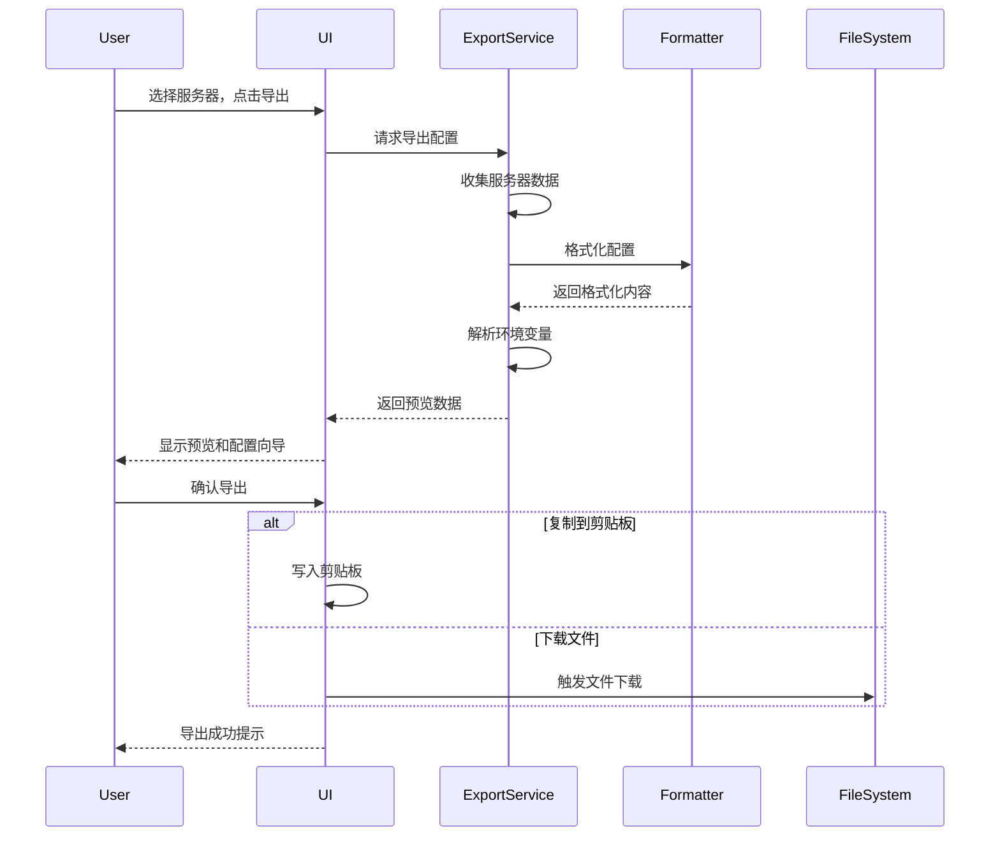

# MCP 导出功能 PRD (Product Requirements Document)

## 1. 概述

### 1.1 文档信息
- **项目名称**: MCP Agents Hub 导出功能
- **版本**: 1.0.0
- **创建日期**: 2026-03-12
- **状态**: 草稿

### 1.2 背景
MCP Agents Hub 是一个开源的 MCP Servers 市场平台，用户可以在这里发现、分享和管理 MCP 服务器。随着平台上的 MCP 服务器数量不断增加，用户需要一个便捷的方式将服务器配置导出到本地环境，以便快速安装和使用。

### 1.3 目标
为 MCP Agents Hub 添加导出功能，允许用户将 MCP 服务器配置信息导出为各种格式，方便用户在本地环境中快速部署和配置 MCP 客户端。

---

## 2. 用户故事

### 2.1 核心用户角色
| 角色 | 描述 | 主要需求 |
|------|------|----------|
| 开发者 | 使用 MCP 服务器的应用开发者 | 快速获取服务器配置，集成到开发环境中 |
| 系统管理员 | 管理企业级 MCP 部署 | 批量导出配置，进行批量部署 |
| AI 工具用户 | 使用 AI 助手的普通用户 | 简单的配置导出，一键安装 |

### 2.2 用户故事列表

#### US-01: 单个 MCP 服务器配置导出
**作为** 开发者  
**我想要** 导出单个 MCP 服务器的配置  
**以便于** 快速将其添加到我的 Claude Desktop 或其他 MCP 客户端中

**验收标准:**
- 用户可以从服务器详情页面点击"导出"按钮
- 系统生成符合 MCP 标准的配置格式
- 用户可以选择复制到剪贴板或下载配置文件

#### US-02: 批量导出 MCP 服务器配置
**作为** 系统管理员  
**我想要** 批量导出多个 MCP 服务器的配置  
**以便于** 一次性配置多个服务器到客户端环境

**验收标准:**
- 用户可以在列表页面选择多个服务器
- 系统合并所有选中服务器的配置
- 导出为统一的配置文件格式

#### US-03: 多种导出格式支持
**作为** 开发者  
**我想要** 选择不同的导出格式  
**以便于** 适配不同的 MCP 客户端和部署场景

**验收标准:**
- 支持 JSON 格式（MCP 标准配置）
- 支持 YAML 格式（便于阅读和版本控制）
- 支持 Markdown 格式（用于文档和分享）
- 支持 Shell 脚本格式（自动化安装）

#### US-04: 导出配置预览
**作为** AI 工具用户  
**我想要** 在导出前预览配置内容  
**以便于** 确认配置正确无误

**验收标准:**
- 导出前显示配置预览模态框
- 预览内容语法高亮显示
- 支持配置项的基本编辑

---

## 3. 功能需求

### 3.1 功能列表

| 功能ID | 功能名称 | 优先级 | 描述 |
|--------|----------|--------|------|
| F-01 | 单服务器导出 | P0 | 支持导出单个 MCP 服务器配置 |
| F-02 | 批量服务器导出 | P1 | 支持批量选择并导出多个服务器配置 |
| F-03 | JSON 格式导出 | P0 | 导出标准 MCP JSON 配置格式 |
| F-04 | YAML 格式导出 | P1 | 导出 YAML 格式的配置文件 |
| F-05 | Markdown 格式导出 | P2 | 导出包含配置信息的 Markdown 文档 |
| F-06 | Shell 脚本导出 | P2 | 导出自动化安装脚本 |
| F-07 | 配置预览 | P0 | 导出前预览生成的配置内容 |
| F-08 | 复制到剪贴板 | P0 | 支持一键复制配置到剪贴板 |
| F-09 | 下载配置文件 | P0 | 支持下载配置文件到本地 |
| F-10 | 环境变量处理 | P1 | 智能识别并提示需要配置的环境变量 |
| F-11 | 客户端模板 | P1 | 针对不同客户端生成优化配置 |
| F-12 | 导出历史 | P3 | 记录用户的导出历史 |

### 3.2 导出格式详细规格

#### 3.2.1 JSON 格式 (标准 MCP 配置)

```json
{
  "mcpServers": {
    "github": {
      "command": "npx",
      "args": ["-y", "@modelcontextprotocol/server-github"],
      "env": {
        "GITHUB_PERSONAL_ACCESS_TOKEN": "<YOUR_TOKEN>"
      }
    },
    "filesystem": {
      "command": "npx",
      "args": ["-y", "@modelcontextprotocol/server-filesystem", "/path/to/allowed/dir"],
      "env": {}
    }
  }
}
```

#### 3.2.2 YAML 格式

```yaml
mcpServers:
  github:
    command: npx
    args:
      - "-y"
      - "@modelcontextprotocol/server-github"
    env:
      GITHUB_PERSONAL_ACCESS_TOKEN: "<YOUR_TOKEN>"
  filesystem:
    command: npx
    args:
      - "-y"
      - "@modelcontextprotocol/server-filesystem"
      - "/path/to/allowed/dir"
    env: {}
```

#### 3.2.3 Markdown 格式

```markdown
# MCP Servers Configuration

## GitHub Server
- **Server ID**: github
- **Description**: GitHub API integration
- **Command**: `npx -y @modelcontextprotocol/server-github`
- **Required Environment Variables**:
  - `GITHUB_PERSONAL_ACCESS_TOKEN`: Your GitHub personal access token

### Configuration
\`\`\`json
{
  "command": "npx",
  "args": ["-y", "@modelcontextprotocol/server-github"],
  "env": {
    "GITHUB_PERSONAL_ACCESS_TOKEN": "<YOUR_TOKEN>"
  }
}
\`\`\`
```

#### 3.2.4 Shell 脚本格式

```bash
#!/bin/bash
# MCP Servers Installation Script
# Generated from MCP Agents Hub

echo "Installing MCP Servers..."

# GitHub Server
echo "Configuring GitHub MCP Server..."
export GITHUB_PERSONAL_ACCESS_TOKEN="<YOUR_TOKEN>"

# Filesystem Server
echo "Configuring Filesystem MCP Server..."

echo "Installation complete!"
```

### 3.3 客户端适配模板

支持为以下客户端生成优化配置：

| 客户端名称 | 配置文件路径 | 特殊处理 |
|-----------|-------------|----------|
| Claude Desktop | `~/Library/Application Support/Claude/claude_desktop_config.json` | macOS 默认路径 |
| Claude Desktop (Windows) | `%APPDATA%\Claude\claude_desktop_config.json` | Windows 默认路径 |
| Cursor IDE | `.cursor/mcp.json` | 项目级配置 |
| VS Code MCP Extension | `.vscode/mcp.json` | 项目级配置 |
| Custom Client | 用户自定义 | 通用格式 |

### 3.4 环境变量处理

#### 检测逻辑
1. 扫描服务器配置中的 `env` 字段
2. 识别常见的 API Key 模式：
   - `*_API_KEY`
   - `*_TOKEN`
   - `*_SECRET`
   - `*_PASSWORD`
3. 为每个需要的环境变量提供：
   - 变量名称
   - 获取方式说明
   - 示例值格式
   - 必填/可选标识

#### 导出提示
导出时显示环境变量配置向导：

```
需要配置以下环境变量：

1. GITHUB_PERSONAL_ACCESS_TOKEN (必填)
   - 获取方式: https://github.com/settings/tokens
   - 权限要求: repo, read:org
   
2. ANTHROPIC_API_KEY (可选)
   - 获取方式: https://console.anthropic.com/
```

---

## 4. 技术方案

### 4.1 系统架构

```
┌─────────────────────────────────────────────────────────────┐
│                      Frontend (React)                        │
├─────────────────────────────────────────────────────────────┤
│  ┌──────────────┐  ┌──────────────┐  ┌──────────────────┐  │
│  │ ExportButton │  │ ExportModal  │  │ FormatSelector   │  │
│  └──────────────┘  └──────────────┘  └──────────────────┘  │
│  ┌──────────────┐  ┌──────────────┐  ┌──────────────────┐  │
│  │ ConfigPreview│  │ EnvVarWizard │  │ ClientSelector   │  │
│  └──────────────┘  └──────────────┘  └──────────────────┘  │
├─────────────────────────────────────────────────────────────┤
│                    Export Service Layer                      │
├─────────────────────────────────────────────────────────────┤
│  ┌──────────────┐  ┌──────────────┐  ┌──────────────────┐  │
│  │JSONFormatter │  │ YAMLFormatter│  │ MarkdownFormatter│  │
│  └──────────────┘  └──────────────┘  └──────────────────┘  │
│  ┌──────────────┐  ┌──────────────┐                        │
│  │ShellGenerator│  │ EnvVarParser │                        │
│  └──────────────┘  └──────────────┘                        │
└─────────────────────────────────────────────────────────────┘
```

### 4.2 数据流程



### 4.3 API 设计

#### 前端组件接口

```typescript
interface ExportService {
  // 导出单个服务器
  exportServer(server: MCPServer, options: ExportOptions): ExportResult;
  
  // 批量导出
  exportServers(servers: MCPServer[], options: ExportOptions): ExportResult;
  
  // 生成预览
  generatePreview(servers: MCPServer[], format: ExportFormat): string;
  
  // 解析环境变量
  parseEnvVariables(servers: MCPServer[]): EnvVariable[];
}

interface ExportOptions {
  format: 'json' | 'yaml' | 'markdown' | 'shell';
  client?: 'claude-desktop' | 'cursor' | 'vscode' | 'custom';
  includeEnvHints: boolean;
  prettyPrint: boolean;
}

interface ExportResult {
  content: string;
  filename: string;
  mimeType: string;
  requiredEnvVars: EnvVariable[];
}

interface EnvVariable {
  name: string;
  required: boolean;
  description: string;
  obtainUrl?: string;
  example?: string;
}
```

### 4.4 文件结构

```
client/src/
├── components/
│   └── export/
│       ├── ExportButton.tsx          # 导出按钮组件
│       ├── ExportModal.tsx           # 导出模态框
│       ├── FormatSelector.tsx        # 格式选择器
│       ├── ConfigPreview.tsx         # 配置预览组件
│       ├── EnvVarWizard.tsx          # 环境变量向导
│       └── ClientSelector.tsx        # 客户端选择器
├── services/
│   └── export/
│       ├── index.ts                  # 导出服务入口
│       ├── types.ts                  # 类型定义
│       ├── formatters/
│       │   ├── json.ts               # JSON 格式化器
│       │   ├── yaml.ts               # YAML 格式化器
│       │   ├── markdown.ts           # Markdown 格式化器
│       │   └── shell.ts              # Shell 脚本生成器
│       ├── envParser.ts              # 环境变量解析器
│       └── clientTemplates.ts        # 客户端模板配置
└── hooks/
    └── useExport.ts                  # 导出功能 Hook
```

---

## 5. UI/UX 设计

### 5.1 导出按钮位置

1. **服务器详情页**: 页面顶部操作栏
2. **服务器列表页**: 每行服务器卡片的操作菜单中
3. **批量选择**: 列表顶部批量操作栏

### 5.2 导出流程

```
┌─────────────────────────────────────────────────────────────┐
│                      导出配置                                │
├─────────────────────────────────────────────────────────────┤
│                                                             │
│  选择导出格式:  ○ JSON  ○ YAML  ○ Markdown  ○ Shell 脚本   │
│                                                             │
│  目标客户端:    [Claude Desktop ▼]                          │
│                                                             │
│  ┌─────────────────────────────────────────────────────┐   │
│  │  预览                                                 │   │
│  │  ┌─────────────────────────────────────────────┐    │   │
│  │  │ {                                            │    │   │
│  │  │   "mcpServers": {                            │    │   │
│  │  │     "github": { ... }                        │    │   │
│  │  │   }                                          │    │   │
│  │  │ }                                            │    │   │
│  │  └─────────────────────────────────────────────┘    │   │
│  └─────────────────────────────────────────────────────┘   │
│                                                             │
│  ⚠️ 需要配置环境变量:                                       │
│     • GITHUB_PERSONAL_ACCESS_TOKEN                         │
│                                                             │
│  [复制到剪贴板]                    [下载配置文件]            │
│                                                             │
└─────────────────────────────────────────────────────────────┘
```

### 5.3 批量导出界面

```
┌─────────────────────────────────────────────────────────────┐
│  已选择 5 个服务器                                          │
├─────────────────────────────────────────────────────────────┤
│  ☑ GitHub - GitHub API 集成                                │
│  ☑ Filesystem - 文件系统操作                               │
│  ☑ Slack - Slack 集成                                      │
│  ☑ Postgres - PostgreSQL 数据库                            │
│  ☑ Memory - 内存存储                                       │
│                                                             │
│  [取消选择]                              [导出所选配置]      │
└─────────────────────────────────────────────────────────────┘
```

---

## 6. 非功能性需求

### 6.1 性能要求
- 导出单个服务器配置响应时间 < 100ms
- 批量导出 100 个服务器配置 < 1s
- 配置预览渲染 < 200ms

### 6.2 兼容性要求
- 支持主流浏览器（Chrome, Firefox, Safari, Edge）
- 支持 Node.js 18+
- 生成的配置兼容 MCP 协议规范 v1.0+

### 6.3 安全要求
- 敏感环境变量值使用占位符替代
- 不在导出文件中存储真实的 API Key
- 提供安全配置最佳实践提示

### 6.4 可访问性
- 符合 WCAG 2.1 AA 级标准
- 支持键盘导航
- 支持屏幕阅读器

---

## 7. 实施计划

### 7.1 里程碑

| 阶段 | 内容 | 优先级 |
|------|------|--------|
| M1 | 核心导出功能（单服务器、JSON格式） | P0 |
| M2 | 批量导出、多种格式支持 | P1 |
| M3 | 客户端模板、环境变量向导 | P1 |
| M4 | Markdown/Shell 格式、导出历史 | P2 |

### 7.2 开发任务分解

#### Phase 1: MVP (M1)
- [ ] 创建导出服务基础架构
- [ ] 实现 JSON 格式化器
- [ ] 创建导出按钮和模态框组件
- [ ] 实现配置预览功能
- [ ] 实现复制到剪贴板功能
- [ ] 实现文件下载功能
- [ ] 编写单元测试

#### Phase 2: 功能扩展 (M2)
- [ ] 实现批量选择界面
- [ ] 实现 YAML 格式化器
- [ ] 添加格式选择器组件
- [ ] 优化导出性能

#### Phase 3: 用户体验优化 (M3)
- [ ] 实现客户端模板系统
- [ ] 创建环境变量解析器
- [ ] 创建环境变量配置向导
- [ ] 添加客户端选择器

#### Phase 4: 高级功能 (M4)
- [ ] 实现 Markdown 格式化器
- [ ] 实现 Shell 脚本生成器
- [ ] 实现导出历史记录
- [ ] 完善文档和帮助信息

---

## 8. 测试计划

### 8.1 单元测试
- 各格式化器的输出正确性
- 环境变量解析逻辑
- 文件名生成规则

### 8.2 集成测试
- 完整导出流程测试
- 批量导出功能测试
- 不同客户端模板测试

### 8.3 E2E 测试
- 用户完整操作流程
- 多种浏览器兼容性
- 配置文件导入验证

### 8.4 测试用例示例

| 用例ID | 描述 | 前置条件 | 步骤 | 预期结果 |
|--------|------|----------|------|----------|
| TC-01 | 单服务器JSON导出 | 存在MCP服务器 | 点击导出->选择JSON->确认 | 生成正确JSON配置 |
| TC-02 | 批量导出 | 存在多个服务器 | 选择3个服务器->批量导出 | 合并配置正确 |
| TC-03 | 环境变量提示 | 服务器需要API Key | 导出含环境变量服务器 | 显示环境变量提示 |

---

## 9. 风险与缓解

| 风险 | 影响 | 可能性 | 缓解措施 |
|------|------|--------|----------|
| MCP 协议变更导致配置格式不兼容 | 高 | 中 | 建立协议版本检测机制，保持向后兼容 |
| 导出的配置在客户端不工作 | 高 | 中 | 添加配置验证功能，提供常见问题排查指南 |
| 敏感信息泄露 | 高 | 低 | 强制使用占位符，添加安全提示 |
| 大批量导出性能问题 | 中 | 低 | 实现分页导出，添加加载状态提示 |

---

## 10. 成功指标

### 10.1 关键指标 (KPI)
- 导出功能使用率 > 30% 的活跃用户
- 导出成功率 > 95%
- 用户满意度评分 > 4.0/5.0

### 10.2 监控指标
- 每日导出次数
- 各格式使用占比
- 各客户端模板使用占比
- 导出错误率

---

## 11. 附录

### 11.1 参考资料
- [MCP 官方规范](https://modelcontextprotocol.io/)
- [Claude Desktop 配置文档](https://docs.anthropic.com/claude/docs/mcp)
- [YAML 规范](https://yaml.org/spec/)

### 11.2 术语表
| 术语 | 定义 |
|------|------|
| MCP | Model Context Protocol，模型上下文协议 |
| MCP Server | 实现 MCP 协议的服务端组件 |
| MCP Client | 连接 MCP Server 的客户端应用 |
| 环境变量 | 运行时需要的配置变量，如 API Key |

### 11.3 变更历史
| 版本 | 日期 | 作者 | 变更内容 |
|------|------|------|----------|
| 1.0.0 | 2026-03-12 | - | 初始版本 |
